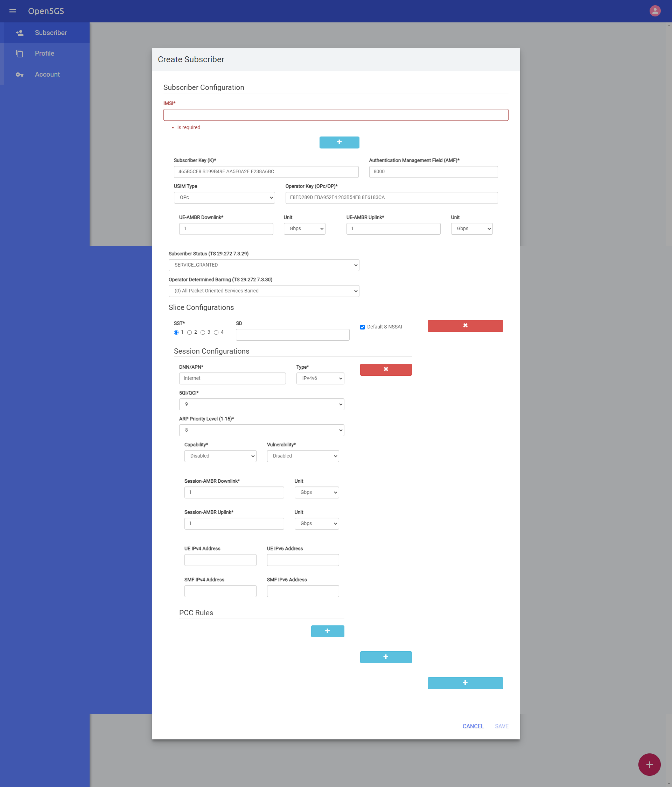
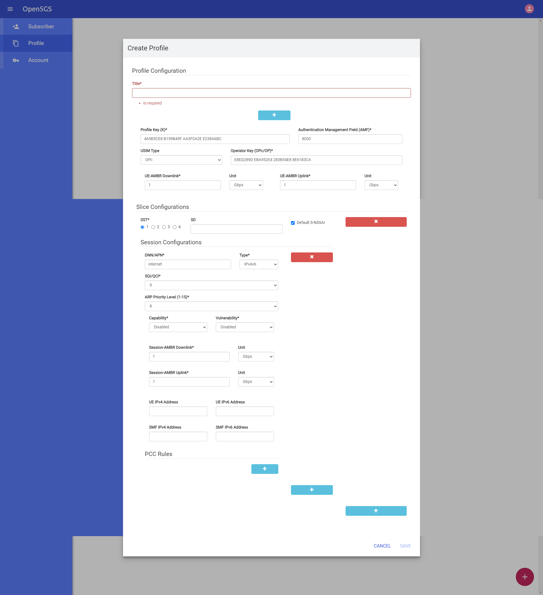

# docker_open5gs
Quite contrary to the name of the repository, this repository contains docker files to deploy an Over-The-Air (OTA) or RF simulated 4G/5G network using following projects:
- Core Network (4G/5G) - open5gs - https://github.com/open5gs/open5gs
- IMS (Only 4G supported i.e. VoLTE) - kamailio
- IMS HSS - https://github.com/nickvsnetworking/pyhss
- Osmocom HLR - https://github.com/osmocom/osmo-hlr
- Osmocom MSC - https://github.com/osmocom/osmo-msc
- srsRAN (4G/5G) - https://github.com/srsran/srsRAN
- UERANSIM (5G) - https://github.com/aligungr/UERANSIM

## Tested Setup

Docker host machine

- Ubuntu 20.04 or 22.04

Over-The-Air setups: 

- srsRAN (eNB/gNB) using Ettus USRP B210
- srsRAN eNB using LimeSDR Mini v1.3
- srsRAN eNB using LimeSDR-USB

RF simulated setups:

 - srsRAN (gNB + UE) simulation over ZMQ
 - UERANSIM (gNB + UE) simulator


## 👻 overview ghost was here 👻

- [Build Time](#build-time)
- [Image Sizes](#image-sizes)
- [deploy-all.yml overview](#functionalities-when-using-deploy-allyml)
  - [Running Containers](#running-containers)
  - [DNS Server](#dns-server)
  - [Metrics aka Prometheus](#metrics-aka-prometheus)
    - [Metrics Collected](#metrics-collected)
    - [Prometheus Config](#prometheus-config)
  - [Open5GS Webui](#open5gs-webui-for-subscriber-and-profiles)
    - [Subscriber Settings](#subscriber)
    - [Profile Settings](#profile)
- [Provisioning of SIM information](#provisioning-of-sim-information)
  - [Provisioning of SIM information via WebUI](#provisioning-of-sim-information-in-open5gs-hss-as-follows)
  - [Provisioning of IMSI and MSISDN with OsmoHLR](#provisioning-of-imsi-and-msisdn-with-osmohlr-as-follows)
  - [Provisioning of SIM information in pyHSS via API (?)](#provisioning-of-sim-information-in-pyhss-is-as-follows)

### build time

it took about 1 hour and some minutes to build all images on Ubuntu 22.04.3 LTS running on Windows 11 WSL2 with 6 cores and 16GB of RAM


### Image Sizes

| Component  | Size   |
|------------|--------|
| open5gs    | 0.69 GB|
| kamailio   | 1.77 GB|
| srslte     | 4.34 GB|
| srsran     | 4.2  GB|
| ueransim   | 0.15 GB|
| dns        | 0.26 GB|
| metrics    | 0.44 GB|
| mysql      | 0.81 GB|
| osmohlr    | 0.17 GB|
| osmomsc    | 0.18 GB|
| pyhss      | 1 GB   |
| rtpengine  | 1.1 GB |
| mongo      | 0.7 GB |
| __Total__   | __~15,81 GB__ |

### todos

- check if this is working and has everything we need
- edit the .env file
- create own compose files
- create pipeline to build and deploy
- add security by maybe creating own CA and certificates or buy them
- add nginx as reverse proxy

 

### functionalities when using deploy-all.yml

```bash
docker compose -f deploy-all.yaml up -d
```

#### running containers
```docker
NAME                COMMAND                  SERVICE             STATUS              PORTS
amf                 "/bin/sh -c /open5gs…"   amf                 running             7777/tcp, 9091/tcp, 38412/sctp
ausf                "/bin/sh -c /open5gs…"   ausf                running             7777/tcp
bsf                 "/bin/sh -c /open5gs…"   bsf                 running             7777/tcp
dns                 "/bin/sh -c '/mnt/dn…"   dns                 running             53/udp
hss                 "/bin/sh -c /open5gs…"   hss                 running             3868/sctp, 3868/tcp, 3868/udp, 5868/sctp, 5868/tcp, 5868/udp
icscf               "/bin/sh -c /kamaili…"   icscf               running             3869/tcp, 3869/udp, 4060/tcp, 4060/udp
metrics             "/bin/sh -c /mnt/met…"   metrics             running             0.0.0.0:9090->9090/tcp
mme                 "/bin/sh -c /open5gs…"   mme                 running             2123/udp, 3868/sctp, 3868/tcp, 3868/udp, 5868/tcp, 5868/sctp, 5868/udp, 36412/sctp, 9091/tcp
mongo               "docker-entrypoint.s…"   mongo               running             27017/tcp, 27017/udp
mysql               "/bin/sh -c /mysql_i…"   mysql               running             3306/tcp
nrf                 "/bin/sh -c /open5gs…"   nrf                 running             7777/tcp
nssf                "/bin/sh -c /open5gs…"   nssf                running             7777/tcp
osmohlr             "/bin/sh -c '/mnt/os…"   osmohlr             running             4222/tcp
osmomsc             "/bin/sh -c '/mnt/os…"   osmomsc             running             2775/tcp, 29118/sctp
pcf                 "/bin/sh -c /open5gs…"   pcf                 running             7777/tcp, 9091/tcp
pcrf                "/bin/sh -c /open5gs…"   pcrf                running             3868/sctp, 3868/tcp, 3868/udp, 5868/sctp, 5868/tcp, 5868/udp
pcscf               "/bin/sh -c /kamaili…"   pcscf               running             0/tcp, 0/udp, 3871/tcp, 3871/udp, 5060/tcp, 5060/udp
pyhss               "/bin/sh -c /mnt/pyh…"   pyhss               running             3868/tcp, 3868/udp, 0.0.0.0:8080->8080/tcp
rtpengine           "/bin/sh -c /mnt/rtp…"   rtpengine           running             0/udp, 2223/udp
scp                 "/bin/sh -c /open5gs…"   scp                 running             7777/tcp
scscf               "/bin/sh -c /kamaili…"   scscf               running             3870/tcp, 3870/udp, 6060/tcp, 6060/udp
sgwc                "/bin/sh -c /open5gs…"   sgwc                running             2123/udp, 8805/udp
sgwu                "/bin/sh -c /open5gs…"   sgwu                running             2152/udp, 8805/udp
smf                 "/bin/sh -c /open5gs…"   smf                 running             2123/udp, 3868/sctp, 3868/tcp, 3868/udp, 5868/tcp, 5868/udp, 7777/tcp, 8805/udp, 5868/sctp, 9091/tcp
smsc                "/bin/sh -c /kamaili…"   smsc                running             7090/tcp, 7090/udp
udm                 "/bin/sh -c /open5gs…"   udm                 running             7777/tcp
udr                 "/bin/sh -c /open5gs…"   udr                 running             7777/tcp
upf                 "/bin/sh -c /open5gs…"   upf                 running             2152/udp, 8805/udp, 9091/tcp
webui               "/bin/sh -c /open5gs…"   webui               running             0.0.0.0:9999->9999/tcp
```

#### DNS Server

[named.conf](dns/named.conf)

```dns
options {
	directory "/var/cache/bind";

	// If there is a firewall between you and nameservers you want
	// to talk to, you may need to fix the firewall to allow multiple
	// ports to talk.  See http://www.kb.cert.org/vuls/id/800113

	// If your ISP provided one or more IP addresses for stable 
	// nameservers, you probably want to use them as forwarders.  
	// Uncomment the following block, and insert the addresses replacing 
	// the all-0's placeholder.

	forwarders {
		8.8.8.8;
	};

	//========================================================================
	// If BIND logs error messages about the root key being expired,
	// you will need to update your keys.  See https://www.isc.org/bind-keys
	//========================================================================
	dnssec-validation no;
	allow-query { any; };

	auth-nxdomain no;    # conform to RFC1035
	listen-on-v6 { any; };
};

//
// Do any local configuration here
//

// Consider adding the 1918 zones here, if they are not used in your
// organization
//include "/etc/bind/zones.rfc1918";
zone "IMS_DOMAIN" {
        type master;
        file "/etc/bind/ims_zone";
};

zone "EPC_DOMAIN" {
        type master;
        file "/etc/bind/epc_zone";
};

zone "PUB_3GPP_DOMAIN" {
        type master;
        file "/etc/bind/pub_3gpp_zone";
};

zone "e164.arpa" {
        type master;
        file "/etc/bind/e164.arpa";
};
```
[e164.arpa](dns/e164.arpa)
```dns
$TTL 1h
@ IN SOA ns.e164.arpa. root.e164.arpa. (
                                                        2009010918 ;serial
                                                        3600 ;refresh
                                                        3600 ;retry
                                                        3600 ;expire
                                                        3600 ;minimum TTL
)
@ IN NS e164.arpa.
@ IN A DNS_IP

; Wildcard to match any tel:+xxxx and change to sip:xxxx@IMS_DOMAIN
* IN NAPTR 10 100 "u" "E2U+sip" "!(^.*$)!sip:\\1@IMS_DOMAIN!" .
* IN NAPTR 20 100 "u" "E2U+sip" "!(^.*$)!sip:+\\1@IMS_DOMAIN!" .
```
[epc_zone](dns/epc_zone)
```dns
$ORIGIN EPC_DOMAIN.
$TTL 1W
@                       1D IN SOA       localhost. root.localhost. (
                                        1		; serial
                                        3H              ; refresh
                                        15M             ; retry
                                        1W              ; expiry
                                        1D )            ; minimum

                        1D IN NS        epcns
epcns                   1D IN A         DNS_IP

pcrf                    1D IN A         PCRF_IP
```

[ims_zone](dns/ims_zone)
```dns
$ORIGIN IMS_DOMAIN.
$TTL 1W
@                       1D IN SOA       localhost. root.localhost. (
                                        1		; serial
                                        3H              ; refresh
                                        15M             ; retry
                                        1W              ; expiry
                                        1D )            ; minimum

                        1D IN NS        ns
ns                      1D IN A         DNS_IP

pcscf                   1D IN A         PCSCF_IP
_sip._udp.pcscf         1D SRV 0 0 5060 pcscf
_sip._tcp.pcscf         1D SRV 0 0 5060 pcscf

icscf                   1D IN A         ICSCF_IP
_sip._udp               1D SRV 0 0 4060 icscf
_sip._tcp               1D SRV 0 0 4060 icscf

scscf                   1D IN A         SCSCF_IP
_sip._udp.scscf         1D SRV 0 0 6060 scscf
_sip._tcp.scscf         1D SRV 0 0 6060 scscf

hss                     1D IN A         PYHSS_IP

smsc                    1D IN A         SMSC_IP
_sip._udp.smsc          1D SRV 0 0 7090 smsc
_sip._tcp.smsc          1D SRV 0 0 7090 smsc
```

[pub_3gpp_zone](dns/pub_3gpp_zone)
```dns
$ORIGIN PUB_3GPP_DOMAIN.
$TTL 1W
@                       1D IN SOA       localhost. root.localhost. (
                                        1		; serial
                                        3H              ; refresh
                                        15M             ; retry
                                        1W              ; expiry
                                        1D )            ; minimum

                        1D IN NS        pubns
pubns                   1D IN A         DNS_IP

aes                     1D IN A         ENTITLEMENT_SERVER_IP

```
#### Metrics aka Prometheus

http://<DOCKER_HOST_IP>:9090/

##### Metrics collected

- amf_session
- bearers_active
- enb
- enb_ue
- fivegs_amffunction_amf_authreject
- fivegs_amffunction_amf_authreq
- fivegs_amffunction_mm_confupdate
- fivegs_amffunction_mm_confupdatesucc
- fivegs_amffunction_mm_paging5greq
- fivegs_amffunction_mm_paging5gsucc
- fivegs_amffunction_rm_regemergreq
- fivegs_amffunction_rm_regemergsucc
- fivegs_amffunction_rm_reginitreq
- fivegs_amffunction_rm_reginitsucc
- fivegs_amffunction_rm_regmobreq
- fivegs_amffunction_rm_regmobsucc
- fivegs_amffunction_rm_regperiodreq
- fivegs_amffunction_rm_regperiodsucc
- fivegs_ep_n3_gtp_indatapktn3upf
- fivegs_ep_n3_gtp_outdatapktn3upf
- fivegs_smffunction_sm_n4sessionestabreq
- fivegs_smffunction_sm_n4sessionreport
- fivegs_smffunction_sm_n4sessionreportsucc
- fivegs_upffunction_sm_n4sessionestabreq
- fivegs_upffunction_sm_n4sessionreport
- fivegs_upffunction_sm_n4sessionreportsucc
- fivegs_upffunction_upf_sessionnbr
- gn_rx_createpdpcontextreq
- gn_rx_deletepdpcontextreq
- gn_rx_parse_failed
- gnb
- gtp1_pdpctxs_active
- gtp2_sessions_active
- gtp_new_node_failed
- gtp_peers_active
- mme_session
- process_cpu_seconds_total
- process_max_fds
- process_open_fds
- process_resident_memory_bytes
- process_start_time_seconds
- process_virtual_memory_bytes
- process_virtual_memory_max_bytes
- ran_ue
- s5c_rx_createsession
- s5c_rx_deletesession
- s5c_rx_parse_failed
- scrape_duration_seconds
- scrape_samples_post_metric_relabeling
- scrape_samples_scraped
- scrape_series_added
- ues_active
- up

##### Prometheus Config

[prometheus.yml](metrics/prometheus.yml)

```yaml
global:
  scrape_interval: 5s

  external_labels:
    monitor: 'open5gs-monitor'

scrape_configs:
  - job_name: 'amf'
    static_configs:
      - targets: ['AMF_IP:9091']
  - job_name: 'smf'
    static_configs:
      - targets: ['SMF_IP:9091']
  - job_name: 'pcf'
    static_configs:
      - targets: ['PCF_IP:9091']
  - job_name: 'upf'
    static_configs:
      - targets: ['UPF_IP:9091']
  - job_name: 'mme'
    static_configs:
      - targets: ['MME_IP:9091']
```

#### Open5GS WebUI for Subscriber and Profiles

http://<DOCKER_HOST_IP>:9999/
admin / 1432

##### Subscriber


##### Profile



## Building docker images

* Mandatory requirements:
  * [docker-ce](https://docs.docker.com/install/linux/docker-ce/ubuntu) - Version 22.0.5 or above
  * [docker compose](https://docs.docker.com/compose) - Version 2.14 or above


#### Clone repository and build base docker image of open5gs, kamailio, srsRAN_4G, srsRAN_Project, ueransim

```
cd ..
set -a
source .env
sudo ufw disable
sudo sysctl -w net.ipv4.ip_forward=1
sudo cpupower frequency-set -g performance

# For 4G deployment only
docker compose -f 4g-volte-deploy.yaml build

# For 5G deployment only
docker compose -f sa-deploy.yaml build
```

## Network and deployment configuration

The setup can be mainly deployed in two ways:

1. Single host setup where eNB/gNB and (EPC+IMS)/5GC are deployed on a single host machine
2. Multi host setup where eNB/gNB is deployed on a separate host machine than (EPC+IMS)/5GC

### Single Host setup configuration
Edit only the following parameters in **.env** as per your setup

```
MCC
MNC
DOCKER_HOST_IP --> This is the IP address of the host running your docker setup
UE_IPV4_INTERNET --> Change this to your desired (Not conflicted) UE network ip range for internet APN
UE_IPV4_IMS --> Change this to your desired (Not conflicted) UE network ip range for ims APN
```

### Multihost setup configuration

#### 4G deployment

###### On the host running the (EPC+IMS)

Edit only the following parameters in **.env** as per your setup
```
MCC
MNC
DOCKER_HOST_IP --> This is the IP address of the host running (EPC+IMS)
SGWU_ADVERTISE_IP --> Change this to value of DOCKER_HOST_IP
UE_IPV4_INTERNET --> Change this to your desired (Not conflicted) UE network ip range for internet APN
UE_IPV4_IMS --> Change this to your desired (Not conflicted) UE network ip range for ims APN
```

Under **mme** section in docker compose file (**4g-volte-deploy.yaml**), uncomment the following part
```yaml
...
    # ports:
    #   - "36412:36412/sctp"
...
```

Then, uncomment the following part under **sgwu** section
```yaml
...
    # ports:
    #   - "2152:2152/udp"
...
```

###### On the host running the eNB

Edit only the following parameters in **.env** as per your setup
```
MCC
MNC
DOCKER_HOST_IP --> This is the IP address of the host running eNB
MME_IP --> Change this to IP address of host running (EPC+IMS)
SRS_ENB_IP --> Change this to the IP address of the host running eNB
```

Replace the following part in the docker compose file (**srsenb.yaml**)
```yaml
    networks:
      default:
        ipv4_address: ${SRS_ENB_IP}
networks:
  default:
    external:
      name: docker_open5gs_default
```
with 
```
	network_mode: host
```

#### 5G SA deployment

###### On the host running the 5GC

Edit only the following parameters in **.env** as per your setup
```
MCC
MNC
DOCKER_HOST_IP --> This is the IP address of the host running 5GC
UPF_ADVERTISE_IP --> Change this to value of DOCKER_HOST_IP
UE_IPV4_INTERNET --> Change this to your desired (Not conflicted) UE network ip range for internet APN
UE_IPV4_IMS --> Change this to your desired (Not conflicted) UE network ip range for ims APN
```

Under **amf** section in docker compose file (**sa-deploy.yaml**), uncomment the following part
```yaml
...
    # ports:
    #   - "38412:38412/sctp"
...
```

Then, uncomment the following part under **upf** section
```yaml
...
    # ports:
    #   - "2152:2152/udp"
...
```

###### On the host running the gNB

Edit only the following parameters in **.env** as per your setup
```
MCC
MNC
DOCKER_HOST_IP --> This is the IP address of the host running gNB
AMF_IP --> Change this to IP address of host running 5GC
SRS_GNB_IP --> Change this to the IP address of the host running gNB
```

Replace the following part in the docker compose file (**srsgnb.yaml**)
```yaml
    networks:
      default:
        ipv4_address: ${SRS_GNB_IP}
networks:
  default:
    external:
      name: docker_open5gs_default
```
with 
```
	network_mode: host
```

## Network Deployment

###### 4G deployment

```
# 4G Core Network + IMS + SMS over SGs
docker compose -f 4g-volte-deploy.yaml up

# srsRAN eNB using SDR (OTA)
docker compose -f srsenb.yaml up -d && docker container attach srsenb

# srsRAN ZMQ eNB (RF simulated)
docker compose -f srsenb_zmq.yaml up -d && docker container attach srsenb_zmq

# srsRAN ZMQ 4G UE (RF simulated)
docker compose -f srsue_zmq.yaml up -d && docker container attach srsue_zmq
```

###### 5G SA deployment

```
# 5G Core Network
docker compose -f sa-deploy.yaml up

# srsRAN gNB using SDR (OTA)
docker compose -f srsgnb.yaml up -d && docker container attach srsgnb

# srsRAN ZMQ gNB (RF simulated)
docker compose -f srsgnb_zmq.yaml up -d && docker container attach srsgnb_zmq

# srsRAN ZMQ 5G UE (RF simulated)
docker compose -f srsue_5g_zmq.yaml up -d && docker container attach srsue_5g_zmq

# UERANSIM gNB (RF simulated)
docker compose -f nr-gnb.yaml up -d && docker container attach nr_gnb

# UERANSIM NR-UE (RF simulated)
docker compose -f nr-ue.yaml up -d && docker container attach nr_ue
```

## Provisioning of SIM information

### Provisioning of SIM information in open5gs HSS as follows:

Open (http://<DOCKER_HOST_IP>:9999) in a web browser, where <DOCKER_HOST_IP> is the IP of the machine/VM running the open5gs containers. Login with following credentials
```
Username : admin
Password : 1423
```

Using Web UI, add a subscriber

#### or using cli 

```
sudo docker exec -it hss misc/db/open5gs-dbctl add 001010123456790 8baf473f2f8fd09487cccbd7097c6862 8E27B6AF0E692E750F32667A3B14605D
```


### Provisioning of IMSI and MSISDN with OsmoHLR as follows:

1. First, login to the osmohlr container

```shell
docker exec -it osmohlr /bin/bash
```

2. Then, telnet to localhost

```shell
$ telnet localhost 4258

OsmoHLR> enable
OsmoHLR#
```

3. Finally, register the subscriber information as in following example:

```shell
OsmoHLR# subscriber imsi 001010123456790 create
OsmoHLR# subscriber imsi 001010123456790 update msisdn 9076543210
```

**Replace IMSI and MSISDN as per your programmed SIM**


### Provisioning of SIM information in pyHSS is as follows:

1. Goto http://<DOCKER_HOST_IP>:8080/docs/
2. Select **apn** -> **Create new APN** -> Press on **Try it out**. Then, in payload section use the below JSON and then press **Execute**

```json
{
  "apn": "internet",
  "apn_ambr_dl": 0,
  "apn_ambr_ul": 0
}
```

Take note of **apn_id** specified in **Response body** under **Server response** for **internet** APN

Repeat creation step for following payload

```json
{
  "apn": "ims",
  "apn_ambr_dl": 0,
  "apn_ambr_ul": 0
}
```

Take note of **apn_id** specified in **Response body** under **Server response** for **ims** APN

**Execute this step of APN creation only once**

3. Next, select **auc** -> **Create new AUC** -> Press on **Try it out**. Then, in payload section use the below example JSON to fill in ki, opc and amf for your SIM and then press **Execute**

```json
{
  "ki": "8baf473f2f8fd09487cccbd7097c6862",
  "opc": "8E27B6AF0E692E750F32667A3B14605D",
  "amf": "8000",
  "sqn": 0,
  "imsi": "001010123456790"
}
```

Take note of **auc_id** specified in **Response body** under **Server response**

**Replace imsi, ki, opc and amf as per your programmed SIM**

4. Next, select **subscriber** -> **Create new SUBSCRIBER** -> Press on **Try it out**. Then, in payload section use the below example JSON to fill in imsi, auc_id and apn_list for your SIM and then press **Execute**

```json
{
  "imsi": "001010123456790",
  "enabled": true,
  "auc_id": 1,
  "default_apn": 1,
  "apn_list": "1,2",
  "msisdn": "9076543210",
  "ue_ambr_dl": 0,
  "ue_ambr_ul": 0
}
```

- **auc_id** is the ID of the **AUC** created in the previous steps
- **default_apn** is the ID of the **internet** APN created in the previous steps
- **apn_list** is the comma separated list of APN IDs allowed for the UE i.e. APN ID for **internet** and **ims** APN created in the previous steps

**Replace imsi and msisdn as per your programmed SIM**

5. Finally, select **ims_subscriber** -> **Create new IMS SUBSCRIBER** -> Press on **Try it out**. Then, in payload section use the below example JSON to fill in imsi, msisdn, msisdn_list, scscf_peer, scscf_realm and scscf for your SIM/deployment and then press **Execute**

```json
{
    "imsi": "001010123456790",
    "msisdn": "9076543210",
    "sh_profile": "string",
    "scscf_peer": "scscf.ims.mnc001.mcc001.3gppnetwork.org",
    "msisdn_list": "[9076543210]",
    "ifc_path": "default_ifc.xml",
    "scscf": "sip:scscf.ims.mnc001.mcc001.3gppnetwork.org:6060",
    "scscf_realm": "ims.mnc001.mcc001.3gppnetwork.org"
}
```

**Replace imsi, msisdn and msisdn_list as per your programmed SIM**

**Replace scscf_peer, scscf and scscf_realm as per your deployment**

## Not supported
- IPv6 usage in Docker
